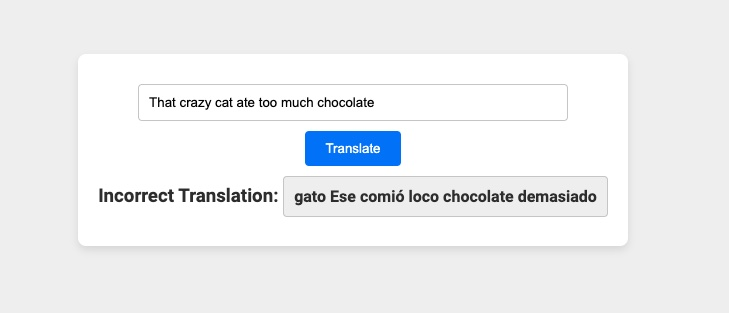
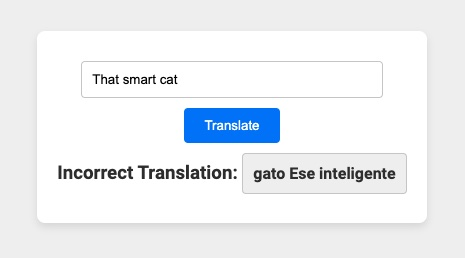

### Day 58: June 23, 2024

# Day 57 of 100 Days of Code: x

## Today's Progress

x

## Thoughts

x

## Hashtags

\#100DaysOfCode \#Python \#DataAnalysis \#LinkedInLearning \#JupyterNotebooks

<hr style="border-width: 3px;">

### Day 57: June 22, 2024

# Day 57 of 100 Days of Code: Exploring NumPy for Data Manipulations and Analysis

## Today's Progress

Focused on performing mathematical operations with NumPy arrays and managing structured data using records and dates.

These skills are essential for handling and analyzing diverse datasets efficiently. Wrapped up the day with a challenging chapter quiz to test my knowledge on these topics.

## Thoughts

Working with NumPy to perform complex mathematical operations and manipulate records and dates has significantly enhanced my ability to deal with real-world data scenarios.

## Hashtags

\#100DaysOfCode \#Python \#DataAnalysis \#LinkedInLearning \#JupyterNotebooks

<hr style="border-width: 3px;">

### Day 56: June 21, 2024

# Day 56 of 100 Days of Code: NumPy Array Indexing

## Today's Progress

Continued exploring NumPy in my Python Data Analysis course, specifically focusing on indexing arrays.

Worked with techniques of accessing and manipulating specific elements, slices, and subsets of data within NumPy arrays, which is crucial for efficient data manipulation in scientific computing.

## Thoughts

Understanding how to index arrays effectively is essential for optimizing data analysis tasks. These skills allow for precise control over data, enabling complex operations on large datasets that are common in real-world scenarios.

## Hashtags

\#100DaysOfCode \#Python \#DataAnalysis \#LinkedInLearning \#JupyterNotebooks

<hr style="border-width: 3px;">

### Day 55: June 20, 2024

# Day 55 of 100 Days of Code: Diving into NumPy for Data Analysis

## Today's Progress

Arrays with NumPy.

I learned about the powerful capabilities of NumPy and started creating my own NumPy arrays.

## Thoughts

Understanding how to effectively create and manipulate arrays opens up numerous possibilities for optimizing data analysis.

## Hashtags

\#100DaysOfCode \#Python \#DataAnalysis \#LinkedInLearning \#JupyterNotebooks

<hr style="border-width: 3px;">

### Day 54: June 19, 2024

# Day 54 of 100 Days of Code: Wordplay and Palindromes in Python

## Today's Progress

Anagrams and palindromes with Python today.

I explored different methods to find anagrams, including sorting and using dictionaries, and learned how to load and manage dictionaries efficiently. I also tackled the Palindromes challenge, enhancing my understanding of string manipulation. To wrap up, I completed the chapter quiz to reinforce my learning.

## Thoughts

The process of implementing various methods to find anagrams was particularly interesting, and the Palindromes challenge tested my skills effectively.

## Hashtags

\#100DaysOfCode \#Python \#DataAnalysis \#LinkedInLearning \#JupyterNotebooks

<hr style="border-width: 3px;">

### Day 53: June 18, 2024

# Day 53 of 100 Days of Code: Advanced Python Containers and Chapter Quiz

## Today's Progress

Advanced further in my study of Python by exploring complex container types.

I also applied those concepts in a challenging chapter quiz.

## Thoughts

Engaging with advanced containers has sharpened my skills in managing and manipulating complex data structures, essential for robust Python programming.

## Hashtags

\#100DaysOfCode \#Python \#DataAnalysis \#LinkedInLearning \#JupyterNotebooks

<hr style="border-width: 3px;">

### Day 52: June 17, 2024

# Day 52 of 100 Days of Code: Advancing Python Data Structures

## Today's Progress

Continued with the Python Data Analysis course on LinkedIn Learning.

Today's lessons covered more advanced data structures including dictionaries and sets, and I dived into the power of comprehensions for streamlined data processing.

## Thoughts

Learning about dictionaries and sets has deepened my understanding of efficient data storage and retrieval in Python. Comprehensions, particularly list and dictionary comprehensions, are game changers for writing more concise and readable code, especially when dealing with large datasets.

## Hashtags

\#100DaysOfCode \#Python \#DataAnalysis \#LinkedInLearning \#JupyterNotebooks

<hr style="border-width: 3px;">

### Day 51: June 16, 2024

# Day 51 of 100 Days of Code: Strengthening Python Fundamentals

## Today's Progress

Continued my journey in the Python Data Analysis course on LinkedIn Learning.

Today was all about brushing up on the basics: I practiced using Python loops and sequences, including lists, tuples, and understanding the slicing syntax. These fundamentals are crucial for efficient data manipulation and analysis.

## Thoughts

Revisiting these core Python elements has reinforced how vital foundational knowledge is for tackling more complex data analysis tasks. Mastering lists, tuples, and slicing not only enhances my coding efficiency but also prepares me for deeper data manipulation techniques.

## Hashtags

\#100DaysOfCode \#Python \#DataAnalysis \#LinkedInLearning \#JupyterNotebooks

<hr style="border-width: 3px;">

### Day 50: June 15, 2024

# Day 50 of 100 Days of Code: Embarking on Python Data Analysis

## Today's Progress

Starting a new course on Python Data Analysis on LinkedIn Learning.

Today was all about setting up the foundation: watched the introduction, ensured my development environment was fully operational on my Mac, and began working with Jupyter Notebooks.

## Thoughts

Diving into data analysis with Python is exciting as it opens up a plethora of possibilities for extracting insights from data. Using Jupyter Notebooks for interactive coding sessions is proving to be an effective way to learn and visualize data dynamically.

## Hashtags

\#100DaysOfCode \#Python \#DataAnalysis \#LinkedInLearning \#JupyterNotebooks

<hr style="border-width: 3px;">

### Day 49: June 14, 2024

# Day 49 of 100 Days of Code: Deployment Troubleshooting and README Enhancements

## Today's Progress

Focused on troubleshooting and resolved deployment issues for "Mistranslatio".

After ensuring the correct setup of my project directories and files, I managed to successfully deploy the app on Heroku. However, I encountered problems with the translation feature not working and content security policy (CSP) errors. I added necessary headers to handle CSP issues and updated my README file to include sections for edge cases and future improvements. Despite the challenges, the app is now live and functioning as expected.

## Thoughts

Deployment can be a complex and sometimes frustrating part of the development process, but it's rewarding to see the app live and accessible online. Today, I learned the importance of meticulously managing project files and configurations, especially when deploying to a platform like Heroku. Adding the new sections to the README also helped in documenting known issues and potential enhancements, making it easier for future contributors to understand the project.



## Links to Work

Check out the live application here: [https://mistranslatio-5f22cacf77e2.herokuapp.com/](https://mistranslatio-5f22cacf77e2.herokuapp.com/)
Repo: [https://github.com/Jason-Hargrove/mistranslatio.git](https://github.com/Jason-Hargrove/mistranslatio.git)

## Hashtags

\#100DaysOfCode \#Translation \#Spanish \#Challenge \#React \#Heroku

<hr style="border-width: 3px;">

### Day 48: June 13, 2024

# Day 48 of 100 Days of Code: Successfully Deploying "Mistranslatio" to Heroku

## Today's Progress

The app that humorously translates English text into incorrect Spanish, faced several deployment challenges.

Most the issues seem related to Content Security Policy (CSP) settings and directory structure. I updated the CSP settings in server.js to include necessary directives for loading Google Fonts and connecting to external APIs. Additionally, I ensured that the project directory structure was correct, particularly addressing a misspelling in the client folder name. Finally, I successfully deployed the app, though further testing revealed some additional tweaks are still needed.



## Thoughts

Deploying a full-stack application to Heroku was an insightful process that highlighted the importance of meticulous configuration and attention to detail. Ensuring correct CSP settings and project structure are crucial for a successful deployment. Despite the challenges, seeing the app live is rewarding, and I'm eager to polish it further. This experience reinforced the importance of iterative testing and deployment in the development workflow.

## Links to Work

Check out the live application here: [https://mistranslatio-5f22cacf77e2.herokuapp.com/](https://mistranslatio-5f22cacf77e2.herokuapp.com/)
Repo: [https://github.com/Jason-Hargrove/mistranslatio.git](https://github.com/Jason-Hargrove/mistranslatio.git)

## Hashtags

\#100DaysOfCode \#Translation \#Spanish \#Challenge \#React \#Heroku

<hr style="border-width: 3px;">

### Day 47: June 12, 2024

# Day 47 of 100 Days of Code: Tackling Deployment and CSP Issues

## Today's Progress

Attempted to deploy my React and Node.js application, "Mistranslatio," to Heroku.

The process involved several steps to ensure the correct setup and configurations for a successful deployment. I ensured the server correctly served the static files from the React build directory, and attempting to addressed Content Security Policy (CSP) issues.

I encountered a few challenges, including CSP errors and a misspelled directory name, which led to serving static files incorrectly. After renaming the directory correctly, I adjusted my server.js file to properly serve the static files and set appropriate CSP headers. Despite these efforts, the deployment issues persisted, and I plan to start fresh tomorrow.


## Thoughts

Today was a reminder of the intricacies involved in deploying a full-stack application. Handling deployment issues and configuring security policies can be challenging but are essential for a robust application. Although I faced several hurdles, the experience was educational and helped me better understand the deployment process on Heroku. Tomorrow, I plan to revisit the deployment with a fresh perspective and ensure all configurations are set correctly for a successful deployment.

## Link to Work

Repo: [https://github.com/Jason-Hargrove/mistranslatio.git](https://github.com/Jason-Hargrove/mistranslatio.git)

## Hashtags

\#100DaysOfCode \#Translation \#Spanish \#Challenge \#React

<hr style="border-width: 3px;">

### Day 46: June 11, 2024

# Day 46 of 100 Days of Code: Styling "Mistranslatio"

## Today's Progress

Focusing entirely on styling today of my mistranslating React app.

Updated the visual presentation to ensure that the user interface is not only functional but also visually appealing.

## Thoughts

Styling is as crucial as functionality in developing software. A well-designed interface enhances user experience, making interactions smoother and more intuitive. Tomorrow, I plan to revisit the logic to optimize performance and improve functionality.

## Link to Work

Repo: [https://github.com/Jason-Hargrove/mistranslatio.git](https://github.com/Jason-Hargrove/mistranslatio.git)

## Hashtags

\#100DaysOfCode \#Translation \#Spanish \#Challenge \#React

<hr style="border-width: 3px;">

### Day 45: June 10, 2024

# Day 45 of 100 Days of Code: Mistranslatio - Incorrect Spanish Translator

## Today's Progress

A friend challenged me to create a React app that mistranslates Spanish.

I've integrated the MyMemory Translation API into my React and Node.js application.

I implemented custom logic to generate incorrect translations and ensured smooth communication between the frontend and backend. Additionally, I cleaned up unnecessary files from the project directory to streamline the structure.

## Thoughts

I learned the importance of robust error handling and logging when working with external APIs.

## Link to Work

Repo: [https://github.com/Jason-Hargrove/mistranslatio.git](https://github.com/Jason-Hargrove/mistranslatio.git)

## Hashtags

\#100DaysOfCode \#Translation \#Spanish \#Challenge \#React

<hr style="border-width: 3px;">

### Day 44: June 9, 2024

# Day 44 of 100 Days of Code: Completing Python OOP Course

## Today's Progress

Completed the "Python Object-Oriented Programming" course on LinkedIn Learning.

This journey has deepened my understanding of Python's OOP concepts, including classes, inheritance, magic methods, and much more.

## Thoughts

Finishing this comprehensive course has not only solidified my grasp of OOP principles but has also given me a robust toolkit for tackling more complex software development projects with Python.

## Link to Work

Repo: [https://github.com/Jason-Hargrove/python-object-oriented-programming](https://github.com/Jason-Hargrove/python-object-oriented-programming)

## Hashtags

\#100DaysOfCode \#Python \#ObjectOrientedProgramming

<hr style="border-width: 3px;">

### Day 43: June 8, 2024

# Day 43 of 100 Days of Code: Python Data Classes

## Today's Progress

Worked with a feature that streamlines the process of creating classes that are primarily storing data.

I learned how to define a data class, utilize post-initialization to execute additional steps after object creation, and incorporate default values for attributes to simplify instantiation.

## Thoughts

Data classes in Python are incredibly useful for reducing boilerplate code in classes while making them more readable and maintainable.

## Link to Work

Repo: [https://github.com/Jason-Hargrove/python-object-oriented-programming](https://github.com/Jason-Hargrove/python-object-oriented-programming)

## Hashtags

\#100DaysOfCode \#Python \#ObjectOrientedProgramming

<hr style="border-width: 3px;">

### Day 42: June 7, 2024

# Day 42 of 100 Days of Code: Comparison in Python with Magic Methods

## Today's Progress

Chapter 3 "Magic Object Methods" coding challenge and quiz.

I implemented custom comparison methods for sorting stocks and bonds based on price and yield, respectively. Using Python's magic methods, I added functionality to sort these financial instruments effectively within their classes.

I successfully sorted lists of stocks and bonds, ensuring that they could be compared according to their specific financial metrics.

## Thoughts

This challenge was a fantastic practical application of Python's magic methods, demonstrating how they can be leveraged to tailor object behavior in a way that's both intuitive and efficient.

## Link to Work

Repo: [https://github.com/Jason-Hargrove/python-object-oriented-programming](https://github.com/Jason-Hargrove/python-object-oriented-programming)

## Hashtags

\#100DaysOfCode \#Python \#ObjectOrientedProgramming

<hr style="border-width: 3px;">

### Day 41: June 6, 2024

# Day 41 of 100 Days of Code: Magic Methods in Python OOP

## Today's Progress

Magic methods for equality and comparison, attribute access, and making objects callable.

These methods are crucial for customizing how objects compare to each other, how their attributes are accessed and modified, and how they can be called like functions.

## Thoughts

Exploring these advanced features of Python's magic methods has deepened my appreciation for the language's flexibility and power.

## Link to Work

Repo: [https://github.com/Jason-Hargrove/python-object-oriented-programming](https://github.com/Jason-Hargrove/python-object-oriented-programming)

## Hashtags

\#100DaysOfCode \#Python \#ObjectOrientedProgramming

<hr style="border-width: 3px;">

### Day 40: June 5, 2024

# Day 40 of 100 Days of Code: Exploring Magic Methods in Python OOP

## Today's Progress

Studied Python's "magic" methods today as part of my ongoing study in Object-Oriented Programming.

I learned about special methods, their purpose, and how to use them for customizing class behavior, particularly focusing on string representations of objects.

## Thoughts

Magic methods in Python, such as **str** and **repr**, are foundational for defining how objects behave with built-in Python operations.

## Link to Work

Repo: [https://github.com/Jason-Hargrove/python-object-oriented-programming](https://github.com/Jason-Hargrove/python-object-oriented-programming)

## Hashtags

\#100DaysOfCode \#Python \#ObjectOrientedProgramming

<hr style="border-width: 3px;">

### Day 39: June 4, 2024

# Day 39 of 100 Days of Code: Tackling Inheritance and Abstract Classes in Python

## Today's Progress

Completed Chapter 2 challenge and quiz on inheritance and abstract classes.

The challenge involved creating a class structure to represent stocks and bonds using abstract classes to enforce certain design principles.

## Thoughts

This challenge was a fantastic way to deepen my understanding of OOP principles in Python, especially how to design flexible and reusable code with abstract classes.

## Link to Work

Repo: [https://github.com/Jason-Hargrove/python-object-oriented-programming](https://github.com/Jason-Hargrove/python-object-oriented-programming)

## Hashtags

\#100DaysOfCode \#Python \#ObjectOrientedProgramming

<hr style="border-width: 3px;">

### Day 38: June 3, 2024

# Day 38 of 100 Days of Code: Python OOP - Abstract Base Classes, Multiple Inheritance and Interfaces

## Today's Progress

Worked with abstract base classes, multiple inheritance, and interfaces.

Explored how interfaces can be implemented in Python to design cleaner and more modular code.

## Thoughts

Abstract classes and interfaces, in particular, provide a structured way to define blueprints for classes while ensuring that derived classes follow a consistent implementation.

## Link to Work

Repo: [https://github.com/Jason-Hargrove/python-object-oriented-programming](https://github.com/Jason-Hargrove/python-object-oriented-programming)

## Hashtags

\#100DaysOfCode \#Python \#ObjectOrientedProgramming \#Finance \#StockMarket \#TechLearning \#SoftwareDevelopment

<hr style="border-width: 3px;">

### Day 37: June 2, 2024

# Day 37 of 100 Days of Code: Applying OOP to Financial Models

## Today's Progress

Programming challenge involved defining a class to represent stock information.

Including properties like Ticker, Price, and Company. I also implemented a method to return a formatted description of the stock.

```python
class Stock:
    def __init__(self, ticker, price, company):
        self.ticker = ticker
        self.price = price
        self.company = company

    def get_description(self):
        return f"{self.ticker}: {self.company} -- ${self.price}"
```

I tested this setup with stocks like Microsoft, Google, Meta, and Amazon, ensuring the class correctly handles and describes each stock instance.

## Thoughts

This exercise reinforced the power and flexibility of OOP in handling real-world data structures like stock market information.

## Link to Work

Repo: [https://github.com/Jason-Hargrove/python-object-oriented-programming](https://github.com/Jason-Hargrove/python-object-oriented-programming)

## Hashtags

\#100DaysOfCode \##Python \#ObjectOrientedProgramming \#Finance \#StockMarket \#TechLearning \#SoftwareDevelopment

<hr style="border-width: 3px;">

### Day 36: June 1, 2024

# Day 36 of 100 Days of Code: x

## Today's Progress

x

## Thoughts

x

## Hashtags

\#100DaysOfCode

<hr style="border-width: 3px;">

### Day 35: May 31, 2024

# Day 35 of 100 Days of Code: Coding on the Go with Mimo

## Today's Progress

Headed to Evansville, Indiana today, but keeping my streak alive by using Mimo to study Python.

This mobile app allowed me to continue my learning, focusing on Python basics, which is a slight shift from the Object-Oriented Programming I've been doing.

## Thoughts

Using Mimo while traveling has been a great way to make productive use of travel time.

## Hashtags

\#100DaysOfCode \#Python \#Mimo

<hr style="border-width: 3px;">

### Day 34: May 30, 2024

# Day 34 of 100 Days of Code: Python OOP with LinkedIn Learning

## Today's Progress

Explored class methods and members, as well as checking instance types.

These topics are crucial for designing robust and reusable code structures in Python, enhancing both the functionality and interoperability of classes.

## Thoughts

Checking instance types is also integral for ensuring that the interactions between different components of a program are as expected, preventing runtime errors and improving the reliability of software.

## Link to Work

Repo: [https://github.com/Jason-Hargrove/python-object-oriented-programming](https://github.com/Jason-Hargrove/python-object-oriented-programming)

## Hashtags

\#100DaysOfCode \##Python \#ObjectOrientedProgramming \#PythonProgramming

<hr style="border-width: 3px;">

### Day 33: May 29, 2024

# Day 33 of 100 Days of Code: Type Checking in Python OOP

## Today's Progress

Python OOP - focusing on checking instance types.

This essential skill helps ensure that objects and variables are of expected types, crucial for debugging and maintaining robust Python applications.

## Thoughts

Learning how to effectively check instance types has provided me with deeper insights into Python's dynamic typing system.

## Link to Work

Repo: [https://github.com/Jason-Hargrove/python-object-oriented-programming](https://github.com/Jason-Hargrove/python-object-oriented-programming)

## Hashtags

\#100DaysOfCode \##Python \#ObjectOrientedProgramming \#PythonProgramming

<hr style="border-width: 3px;">

### Day 32: May 28, 2024

# Day 32 of 100 Days of Code: Agile with LinkedIn Learning

## Today's Progress

Completed the "Agile Foundations" and "Scrum: Advanced" courses on LinkedIn Learning.

These courses deepened my understanding of agile methodologies and advanced Scrum practices, equipping me with the knowledge to better manage projects and enhance team productivity.

## Thoughts

Diving into Agile and Scrum has reinforced the importance of flexible project management and the value of quick adaptations to change.

## Hashtags

\#100DaysOfCode \#Agile \#Scrum \#LinkedInLearning \#CareerDevelopment

<hr style="border-width: 3px;">

### Day 31: May 27, 2024

# Day 31 of 100 Days of Code: Python Object-Oriented Programming

## Today's Progress

OOP. Set up my development environment, created a new repository for the project, and refreshed my knowledge on OOP concepts.

Started with basic class definitions, laying the groundwork for more complex structures.

## Thoughts

Revisiting the foundational aspects of OOP in Python is exciting. It’s fascinating to see how organizing code into classes and objects can make it more modular, maintainable, and reusable.

## Link to Work

Repo: [https://github.com/Jason-Hargrove/python-object-oriented-programming](https://github.com/Jason-Hargrove/python-object-oriented-programming)

## Hashtags

\#100DaysOfCode \##Python \#ObjectOrientedProgramming \#PythonProgramming

<hr style="border-width: 3px;">

### Day 30: May 26, 2024

# Day 30 of 100 Days of Code: JSON Assertions and Postman Test Automation

## Today's Progress

I focused on JSON assertions, tackling more complex tests, including nested JSON assertions using a mock API.

I completed a chapter quiz on Postman assertions and extensively used the collection runner to run my test collection. Additionally, I exported and ran my collection with Newman, followed by finishing another chapter quiz on running test collections, and resolved some deprecation issues along the way. Today marked the completion of the "Postman Essential Training" tutorial on LinkedIn Learning.

## Thoughts

Wrapping up the Postman tutorial has significantly boosted my skills in API testing, especially in automating and debugging with advanced assertions. Understanding how to effectively structure and automate tests using Newman and Postman's collection runner will be invaluable for maintaining robust API integrations in future projects.

## Hashtags

\#100DaysOfCode \#WebDevelopment \#Postman

<hr style="border-width: 3px;">

### Day 29: May 25, 2024

# Day 29 of 100 Days of Code: Postman Assertions

## Today's Progress

Practiced various types of assertions including status, body content, headers, and response time.

Additionally, I enhanced my debugging skills using the Postman console and tackled a challenge to write custom assertions. I also started exploring JSON assertions and completed a chapter quiz to test my understanding.

## Thoughts

Learning to effectively use assertions in Postman is crucial for ensuring API responses meet expected outcomes.

## Hashtags

\#100DaysOfCode \#WebDevelopment \#Postman

<hr style="border-width: 3px;">

### Day 28: May 24, 2024

# Day 28 of 100 Days of Code: Postman's Environment Variables and Response Handling

## Today's Progress

Created negative API requests and utilized environment variables. Worked on saving API response data as variables and incorporated these variables into new requests. Tackled a challenge - adding variables to requests. Completed Chapter 1 quiz.

## Thoughts

Leveraging environment variables not only makes my requests more dynamic but also secures sensitive data, which is crucial for real-world applications.

## Hashtags

\#100DaysOfCode \#WebDevelopment \#Postman

<hr style="border-width: 3px;">

### Day 27: May 23, 2024

# Day 27 of 100 Days of Code: Refining API Skills with Postman

## Today's Progress

Focused on API interaction fundamentals. Practicing familiar skills.

Advanced through "Postman Essential Training" on LinkedIn Learning today, focusing on API interaction fundamentals. I explored how JSON Web Tokens work and practiced creating HTTP requests including GET, POST, PUT, and DELETE. These are tasks I'm well-acquainted with in my software engineering career, so today was more about refining and practicing familiar skills.

## Thoughts

Even routine practice is crucial for mastery. Revisiting basic concepts with a fresh perspective can often reveal new insights or reinforce critical skills. Continual practice ensures that I remain sharp and ready to tackle more complex challenges.

## Hashtags

\#100DaysOfCode \#WebDevelopment \#Postman

<hr style="border-width: 3px;">

### Day 26: May 22, 2024

# Day 26 of 100 Days of Code: Navigating Tools and Tapping into Creativity

## Today's Progress

Continued with "Postman Essential Training" on LinkedIn Learning.

Encountered some setup issues with Postman, including difficulties in logging in and updating the software. Despite multiple failures, it finally updated, although another update seems needed. Managed to create a collection, organize some folders, and familiarize myself with the API I'll be using, along with exploring Postman’s UI.

## Creative Side

Apart from coding, I spent a significant part of the day engaging with my creative side—downloading fonts and working with Affinity Designer and Photo to design a postcard for an upcoming group art show I'm excited to participate in.

## Thoughts

Today mixed technical challenges with creative pursuits. While technical setups can sometimes be frustrating, they are crucial for smoother operations later on. Balancing coding with creative projects like graphic design provided a refreshing counterpoint to the day’s more tedious tasks.

## Hashtags

\#100DaysOfCode \#WebDevelopment \#Postman \#Art \#GraphicDesign

<hr style="border-width: 3px;">

### Day 25: May 21, 2024

# Day 25 of 100 Days of Code: Deep Learning and Strategic Technology Planning

## Today's Progress

Continued "Practical Deep Learning for Coders: Lesson 1" from FastAI. Also created a technology radar.

Using the technology radar I map out essential skills after finishing the "Recovering from a Job Loss in Technology" course on LinkedIn Learning.

Additionally, I began the "Postman Essential Training" and completed the setup.

## Thoughts

Today was about blending continued deep learning study with strategic planning and skill acquisition. Creating the technology radar felt good; helping me focus my learning on technologies that will shape my career trajectory.

## Hashtags

\#100DaysOfCode \#WebDevelopment \#JavaScript \#FastAI \#MachineLearning \#Poastman

<hr style="border-width: 3px;">

### Day 24: May 20, 2024

# Day 24 of 100 Days of Code: More Deep Learning Journey with FastAI

## Today's Progress

27 minutes into the "Practical Deep Learning for Coders: Lesson 1".

I cloned the FastAI repository, updated my Jupyter Notebook to the latest version.

## Thoughts

I'm excited about the upcoming sessions and the potential to significantly enhance my understanding and skills in this cutting-edge field.

## Hashtags

\#100DaysOfCode \#WebDevelopment \#JavaScript \#CSS \#FastAI \#MachineLearning

<hr style="border-width: 3px;">

### Day 23: May 19, 2024

# Day 23 of 100 Days of Code: Image Classification with FastAI

## Today's Progress

Installed and set up the FastAI and Fastbook libraries, using them for a script that searches, downloads, and categorizes images for classification.

Successfully fine-tuned a model on these images after setting up the necessary data structures and training environments.

## Thoughts

Today's progress on debugging and refining the process was particularly enlightening, reinforcing the importance of precision in machine learning.

## Hashtags

\#100DaysOfCode \#WebDevelopment \#JavaScript \#CSS \#FastAI \#MachineLearning

<hr style="border-width: 3px;">

### Day 22: May 18, 2024

# Day 22 of 100 Days of Code: Portfolio Testing and Diving into Machine Learning with fast.ai

## Today's Progress

Tested my newly deployed portfolio and began exploring machine learning with fast.ai.

Identified several bugs in my portfolio and noted key areas for improvement, particularly with the CSS. While I'll continue to refine these elements daily, I also kicked off a new learning phase with fast.ai.

I set up my Kaggle account, intending to follow along with Lesson 1 of fast.ai. However, I encountered numerous errors, which proved to be a significant learning curve. Troubleshooting these will be my focus tomorrow.

## Thoughts

Balancing portfolio improvements with advancing my technical skills in machine learning is challenging but enriching. Each error is a step forward in understanding more about data science and its practical applications.

## Link to Work

Portfoli: [https://jason-hargrove-portfolio-5abbf0f5084c.herokuapp.com/](https://jason-hargrove-portfolio-5abbf0f5084c.herokuapp.com/)

## Hashtags

\#100DaysOfCode \#WebDevelopment \#JavaScript \#CSS \#FastAI \#MachineLearning

<hr style="border-width: 3px;">

### Day 21: May 17, 2024

# Day 21 of 100 Days of Code: Major Deployment Day on Heroku!

## Today's Progress

Deployed multiple applications on Heroku that are featured in my software engineering portfolio. This includes:

- **Search the MET**: A full-stack MERN application that utilizes the Metropolitan Museum of Art's API to search their collection. Currently troubleshooting some functionality issues.
- **For Goodness Cakes**: Collaborated with a cross-functional team to turn an Instagram bakery concept into a robust full-stack web application.
- **Radioactive Sticker Store**: Deployed a full CRUD multi-page application.
- **Accumulative Dose**: Launched a 'choose your own adventure' game built with HTML, CSS, and JavaScript.

## Thoughts

Encountered a few snags, particularly with the "Search the MET" application that isn't working as expected. Manual testing and debugging are on my immediate agenda to ensure all applications run smoothly and efficiently.

## Link to Work

Portfoli: [https://jason-hargrove-portfolio-5abbf0f5084c.herokuapp.com/](https://jason-hargrove-portfolio-5abbf0f5084c.herokuapp.com/)

## Hashtags

\#100DaysOfCode \#Heroku \#JavaScript \#GitHub \#WebDevelopment

<hr style="border-width: 3px;">

### Day 20: May 16, 2024

# Day 20 of 100 Days of Code: Redeploying My Portfolio on Heroku

## Today's Progress

Today, I took a significant step forward by redeploying my full-stack software engineering portfolio on Heroku.

## Thoughts

While the deployment is up, I still need to conduct thorough testing to ensure all links and functionalities are working as expected. There's a bit of work ahead to refine and optimize the performance of the site.

## Link to Work

Portfoli: [https://jason-hargrove-portfolio-5abbf0f5084c.herokuapp.com/](https://jason-hargrove-portfolio-5abbf0f5084c.herokuapp.com/)

## Hashtags

\#100DaysOfCode \#Heroku \#JavaScript \#GitHub \#WebDevelopment

<hr style="border-width: 3px;">

### Day 19: May 15, 2024

# Day 19 of 100 Days of Code: Python Data Handling, Parsing, and More

## Today's Progress

Finished "Learning Python" on LinkedIn Learning. Today I worked with internet data handling capabilities.

I began by fetching data from the internet using urllib.request and explored JSON data manipulation to enhance my ability to process and interpret web data dynamically. I also tackled SSL issues, ensuring secure data transactions.

Additionally, I practiced parsing and processing HTML with Python's html.parser module, gaining a better understanding of web content manipulation. I then moved on to manipulating XML, learning to parse, modify, and create XML elements which are crucial for managing structured data.

## Thoughts

Feels good to have this course behind me - on to the next!

## Link to Work

Repo: [https://github.com/Jason-Hargrove/learning-python.git](https://github.com/Jason-Hargrove/learning-python.git)

## Hashtags

\#100DaysOfCode \#AIProgramming \#JavaScript \#OpenAI \#GitHub \#WebDevelopment \#CodingChallenge \#MachineLearning

<hr style="border-width: 3px;">

### Day 18: May 14, 2024

# Day 18 of 100 Days of Code: Python Date and Time Code Challenge and Quiz

## Today's Progress

Python coding challenge that involved working extensively with dates and times using the calendar module.

Count the occurrences of a specific day of the week within a given month and year. I wrote a function count_days that efficiently calculates how often each day appears, such as how many Mondays are in December 2025. Additionally, I enhanced my understanding of Python’s date module by writing a script to predict tomorrow’s day of the week.

Following the coding session, I completed a chapter quiz that tested my knowledge on handling dates and times in Python, reinforcing the concepts I practiced in the challenge.

## Thoughts

Got sidetracked a bit with some of the questions, but learned a lot.

## Code

```python
import calendar
from datetime import date

def count_days(year, month, whichday):
    # Generate the calendar for the month
    cal = calendar.monthcalendar(year, month)
    day_count = 0

    # Count occurrences of the specific day of the week
    for week in cal:
        if week[whichday] != 0: # The day of the week is in this week
            day_count += 1

    return day_count

print(count_days(2025, 12, 0))
# Wxpected result: 5
```

## Link to Work

Repo: [https://github.com/Jason-Hargrove/learning-python.git](https://github.com/Jason-Hargrove/learning-python.git)

## Hashtags

\#100DaysOfCode \#AIProgramming \#JavaScript \#OpenAI \#GitHub \#WebDevelopment \#CodingChallenge \#MachineLearning

<hr style="border-width: 3px;">

### Day 17: May 13, 2024

# Day 17 of 100 Days of Code: Python's Calendar Module

## Today's Progress

Explored the Python calendar module, for managing and displaying calendars in different formats.

I started by generating plain text calendars, then moved on to creating HTML formatted calendars which can be seamlessly integrated into web applications. I also delved into looping over days of a month to understand how Python handles dates that span multiple months.

Additionally, I utilized the module to find specific days, such as the first Friday of each month for scheduling recurring team meetings. This practical application of the calendar module highlighted its utility in real-world programming scenarios.

## Thoughts

The ability to manipulate and interact with calendar data programmatically opens up numerous possibilities for developing applications that require scheduling and date tracking.

## Link to Work

Repo: [https://github.com/Jason-Hargrove/learning-python.git](https://github.com/Jason-Hargrove/learning-python.git)

## Hashtags

\#100DaysOfCode \#AIProgramming \#JavaScript \#OpenAI \#GitHub \#WebDevelopment \#CodingChallenge \#MachineLearning

<hr style="border-width: 3px;">

### Day 16: May 12, 2024

# Day 16 of 100 Days of Code: Python's timedelta

## Today's Progress

Experimenting with timedelta objects.

I learned how to manipulate dates and times for different practical applications, like projecting dates in the future and calculating past dates. For example, I calculated what date it would be one year from now, and what the date was exactly one week ago.

## Thoughts

Using timedelta to navigate through time in programming offers a fascinating perspective on how software can interact with real-world time events.

## Link to Work

Repo: [https://github.com/Jason-Hargrove/learning-python.git](https://github.com/Jason-Hargrove/learning-python.git)

## Hashtags

\#100DaysOfCode \#AIProgramming \#JavaScript \#OpenAI \#GitHub \#WebDevelopment \#CodingChallenge \#MachineLearning

<hr style="border-width: 3px;">

### Day 15: May 11, 2024

# Day 15 of 100 Days of Code: Date and Time Formatting in Python

## Today's Progress

Explored Python's datetime module by diving into different ways to format dates and times.

I utilized datetime.now() to fetch current date and time, and experimented with various formatting options to display these values in user-friendly and locale-specific formats.

## Thoughts

Learning to format date and time according to different locales and requirements has been interesting.

## Link to Work

Repo: [https://github.com/Jason-Hargrove/learning-python.git](https://github.com/Jason-Hargrove/learning-python.git)

## Hashtags

\#100DaysOfCode \#AIProgramming \#JavaScript \#OpenAI \#GitHub \#WebDevelopment \#CodingChallenge \#MachineLearning

<hr style="border-width: 3px;">

### Day 14: May 10, 2024

# Day 14 of 100 Days of Code: Exploring Date and Time in Python

## Today's Progress

Handling dates and times using Python’s datetime module.

I started by using the simple today() method from the date class to fetch the current date and then printed out its individual components such as year, month, and day. I also retrieved today’s weekday, understanding Python’s system where Monday is 0 and Sunday is 6. Additionally, I explored the datetime class to get not only today's date but also the current time.

## Thoughts

It’s incredibly useful to see how Python can manage date and time data.

## Link to Work

Repo: [https://github.com/Jason-Hargrove/learning-python.git](https://github.com/Jason-Hargrove/learning-python.git)

## Hashtags

\#100DaysOfCode \#AIProgramming \#JavaScript \#OpenAI \#GitHub \#WebDevelopment \#CodingChallenge \#MachineLearning

<hr style="border-width: 3px;">

### Day 13: May 9, 2024

# Day 13 of 100 Days of Code: Python File Handling and Directory Analysis

## Today's Progress

Python code challenge today: calculating total number of bytes for text files, and chapter quiz.

The task involved filtering to include only .txt files and excluding all others from the byte count. Reinforced my understanding of file operations and directory traversal in Python. Additionally, I completed a chapter quiz to consolidate my learning further.

## Thoughts

Today’s challenge was a great mix of real-world application and theory.

## Link to Work

Repo: [https://github.com/Jason-Hargrove/learning-python.git](https://github.com/Jason-Hargrove/learning-python.git)

## Hashtags

\#100DaysOfCode \#AIProgramming \#JavaScript \#OpenAI \#GitHub \#WebDevelopment \#CodingChallenge \#MachineLearning

<hr style="border-width: 3px;">

### Day 12: May 8, 2024

# Day 12 of 100 Days of Code: File System Operations in Python

## Today's Progress

Python's OS module, specifically exploring its path utilities. I learned how to check for item existence and type, work with file paths, and retrieve the modification times of files. Additionally, I calculated how long ago an item was modified, which adds a practical aspect to managing file systems.

## Thoughts

Understanding and manipulating the file system with Python's built-in capabilities is incredibly powerful.

## Link to Work

Repo: [https://github.com/Jason-Hargrove/learning-python.git](https://github.com/Jason-Hargrove/learning-python.git)

## Hashtags

\#100DaysOfCode \#AIProgramming \#JavaScript \#OpenAI \#GitHub \#WebDevelopment \#CodingChallenge \#MachineLearning

<hr style="border-width: 3px;">

# Day 11 of 100 Days of Code: Python Challenges and File Handling

## Today's Progress

Python coding challenges and quizzes to sharpen my foundational skills. Explored reading and writing files with Python.

## Thoughts

I haven't done coding challenges in a bit. I do enjoy the exposure to different problem-solving approaches.

## Link to Work

Repo: [https://github.com/Jason-Hargrove/learning-python.git](https://github.com/Jason-Hargrove/learning-python.git)

## Hashtags

\#100DaysOfCode \#AIProgramming \#JavaScript \#OpenAI \#GitHub \#WebDevelopment \#CodingChallenge \#MachineLearning

<hr style="border-width: 3px;">

### Day 10: May 6, 2024

# Day 10 of 100 Days of Code: Python Functions and Control Flow

## Today's Progress

Defining functions in Python, using them to encapsulate reusable blocks of code. Conditional logic, employing if, elif, and else statements to control the flow of my programs. The match-case statement proved invaluable for comparing multiple values easily. I also practiced loops—using while and for loops to iterate over data, incorporating break and continue to fine-tune loop execution, and utilizing the enumerate() function to access index during loops. Additionally, I began working with classes and handling exceptions to manage errors more gracefully.

In today's coding challenge, I tackled creating a function to determine if a string is a palindrome, reinforcing my function writing skills and understanding of Python's string manipulation capabilities.

## Thoughts

Each new Python feature I learn opens up more possibilities for solving problems efficiently and creatively.

## Link to Work

Repo: [https://github.com/Jason-Hargrove/learning-python.git](https://github.com/Jason-Hargrove/learning-python.git)

## Hashtags

\#100DaysOfCode \#AIProgramming \#JavaScript \#OpenAI \#GitHub \#WebDevelopment \#CodingChallenge \#MachineLearning

<hr style="border-width: 3px;">

### Day 9: May 5, 2024

# Day 9 of 100 Days of Code: Python Basics and Git Setup

## Today's Progress

Setup a new Git repository. Python basics, working with different data types and global and local variables in functions.

Although I had to cut my study time short today, I really enjoyed getting back to basics and look forward to tackling Python functions tomorrow.

## Thoughts

It's fascinating how different languages handle basics like variable scope.

## Link to Work

Repo: [https://github.com/Jason-Hargrove/learning-python.git](https://github.com/Jason-Hargrove/learning-python.git)

## Hashtags

\#100DaysOfCode \#AIProgramming \#JavaScript \#OpenAI \#GitHub \#WebDevelopment \#CodingChallenge \#MachineLearning

<hr style="border-width: 3px;">

### Day 8: May 4, 2024

# Day 8 of 100 Days of Code: Brushing up on Python

## Today's Progress

Installed latest version of Python and configuring my environment. Solved conflicts in my .zshrc file due to the updated version of Python.

After ensuring everything was set up correctly, I dived into a LinkedIn Learning course on Python. I cloned the course repository and successfully built a small "Hello World" app, marking my first Python project on this new setup.

## Thoughts

Navigating through system configurations and setting up a new programming language was challenging. It's exciting to get back int Python.

## Link to Work

Repo: [https://github.com/Jason-Hargrove/ai-programming-for-javascript-developers.git](https://github.com/Jason-Hargrove/ai-programming-for-javascript-developers.git)

## Hashtags

\#100DaysOfCode \#AIProgramming \#JavaScript \#OpenAI \#GitHub \#WebDevelopment \#CodingChallenge \#MachineLearning

<hr style="border-width: 3px;">

### Day 7: May 3, 2024

# Day 7 of 100 Days of Code: Building an Interactive Assistant in Node.js

## Today's Progress

Created an assistant within my Node app, added threads to capture user input, parsing the assistant response, and LangChain.

## Thoughts

Each step forward in this project opens up new possibilities for creating more intuitive and responsive user interactions.

## Link to Work

Repo: [https://github.com/Jason-Hargrove/ai-programming-for-javascript-developers.git](https://github.com/Jason-Hargrove/ai-programming-for-javascript-developers.git)

## Hashtags

\#100DaysOfCode \#AIProgramming \#JavaScript \#OpenAI \#GitHub \#WebDevelopment \#CodingChallenge \#MachineLearning

<hr style="border-width: 3px;">

### Day 6: May 2, 2024

# Day 6 of 100 Days of Code: Using DALLI-E 3 for Image Generation

## Today's Progress

Integrated DALL-E 3 into my project using Axios for API requests. Used Assistants API playground.

## Thoughts

While the outcomes vary, the process of exploring AI's creative capabilities is consistently intriguing and enjoyable.

## Link to Work

Repo: [https://github.com/Jason-Hargrove/ai-programming-for-javascript-developers.git](https://github.com/Jason-Hargrove/ai-programming-for-javascript-developers.git)

## Hashtags

\#100DaysOfCode \#AIProgramming \#JavaScript \#OpenAI \#GitHub \#WebDevelopment \#CodingChallenge \#MachineLearning

<hr style="border-width: 3px;">

### Day 5: May 1, 2024

# Day 5 of 100 Days of Code: Using AI and Node to Transcribe Audio

## Today's Progress

Today was all about setting up a backend using Node.js. I installed essential packages like dotenv for managing environment variables, axios for making HTTP requests, and form-data for handling form submissions. I also created an .env file to securely store my API key, transitioning from inputting it directly in the terminal—a practice I'm accustomed to and find secure.

The journey wasn’t without its hurdles; I spent a significant portion troubleshooting. At the end, I discovered a couple of bugs—one due to a misspelled variable and another from using the incorrect built-in function.

## Thoughts

The process of debugging and troubleshooting is often more time-consuming than writing the code itself, but it is just as crucial for the development process. Today's session reinforced the importance of attention to detail and the value of a good debugging strategy.

## Link to Work

Repo: [https://github.com/Jason-Hargrove/ai-programming-for-javascript-developers.git](https://github.com/Jason-Hargrove/ai-programming-for-javascript-developers.git)

## Hashtags

\#100DaysOfCode \#AIProgramming \#JavaScript \#OpenAI \#GitHub \#WebDevelopment \#CodingChallenge \#MachineLearning

<hr style="border-width: 3px;">

### Day 4: Apr 30, 2024

# Day 4 of My 100 Days of Code: Venturing into AI with JavaScript

## Today's Progress

Incorporating external APIs, allowing my application to interact dynamically with other services. I implemented a feature using 'readline' to accept user inputs, which has made the interaction more engaging.

One of the highlights of today was creating a function that generates descriptions for images based on their URLs — a fantastic way to merge vision and language models. Additionally, I ventured into audio by recording an MP3 file and successfully transcribing the audio using OpenAI's capabilities through a curl request, demonstrating the versatility of AI in handling various media types.

## Thoughts

Today seemed pretty easy, but long. The ability to transcribe audio and describe images has opened up new possibilities for feature development in my project.

## Link to Work

Repo: [https://github.com/Jason-Hargrove/ai-programming-for-javascript-developers.git](https://github.com/Jason-Hargrove/ai-programming-for-javascript-developers.git)

## Hashtags

\#100DaysOfCode \#AIProgramming \#JavaScript \#OpenAI \#GitHub \#WebDevelopment \#CodingChallenge \#MachineLearning

<hr style="border-width: 3px;">

### Day 3: Apr 29, 2024

# Day 3 of My 100 Days of Code: Venturing into AI with JavaScript

## Today's Progress

I started by generating an API key and setting up a language model to begin crafting AI-driven interactions. I wrote functions to handle AI responses and set up a GitHub repository to track my project. However, I encountered some hurdles with API key permissions and billing issues, which I managed to resolve after some troubleshooting.

I experimented with streams and creating dynamic prompts, and spent some time refactoring my functions to make them cleaner and more efficient. Additionally, I set up templates and customized questions to make the AI interactions more engaging and user-specific.

## Thoughts

Working through the API key and billing challenges was a bit tricky.

## Looking Ahead

Tomorrow, I'll start incorporating external APIs into my project to enhance the functionality and responsiveness of the AI.

## Link to Work

Repo: [https://github.com/Jason-Hargrove/ai-programming-for-javascript-developers.git](https://github.com/Jason-Hargrove/ai-programming-for-javascript-developers.git)

## Hashtags

\#100DaysOfCode \#AIProgramming \#JavaScript \#OpenAI \#GitHub \#WebDevelopment \#CodingChallenge \#MachineLearning

<hr style="border-width: 3px;">

### Day 2: Apr 28, 2024

# Day 2 of My 100 Days of Code: Venturing into AI with JavaScript

## Introduction

Diving into "AI Programming for JavaScript Developers" on LinkedIn Learning.

## Today's Progress

I began by exploring AI in the JavaScript ecosystem, understanding how JavaScript developers can leverage AI technologies. I set up my development environment, installed the OpenAI library.

## Thoughts

The setup went smoothly. Tomorrow, I'll add my API key and begin interacting with AI models directly from my code.

## Hashtags

\#100DaysOfCode \#AIProgramming \#JavaScript \#OpenAI \#LinkedInLearning \#WebDevelopment \#CodingChallenge

<hr style="border-width: 3px;">

### Day 1: Apr 27, 2024

# Day 1 of My 100 Days of Code: Kicking Off with Vue.js, Axios, and GitHub Pages!

## Introduction

Today marks the first day of my 100 Days of Code challenge! I'm excited to sharpen my skills in web development. With this project I focused on Vue.js, Axios for API handling, and deployed to GitHub Pages. My journey began when a friend needing help with his computer science homework, and wanted to introduce him to peer programming.

## Today's Progress

I initiated a Vue.js project where my main task was to integrate Axios to fetch JSON data. I successfully pulled in a dataset and implemented filtering logic to manage the data displayed in a user-friendly table format. This involved configuring Bootstrap for the UI to ensure the application looks appealing.

## Thoughts

Working through the initial configurations and integrations posed a good challenge, particularly around handling asynchronous data fetching and rendering it effectively. Overcoming these challenges with Axios and Vue.js filters boosted my confidence and deepened my understanding of frontend development.

## Link to Work

Repo: [https://github.com/Jason-Hargrove/vue-axios-app.git](https://github.com/Jason-Hargrove/vue-axios-app.git)

Visit site: [https://jason-hargrove.github.io/vue-axios-app/](https://jason-hargrove.github.io/vue-axios-app/)

## Hashtags

\#100DaysOfCode \#VueJS \#Axios \#GitHubPages \#WebDevelopment \#CodingChallenge
